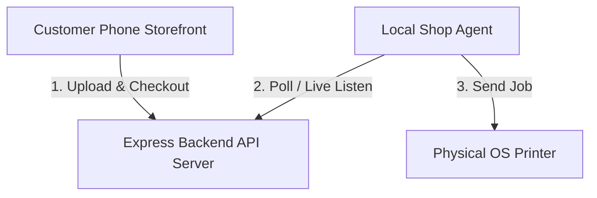

# 🍏 InstaPrint: Self-Service Kiosk Printing System

InstaPrint is a complete, self-service kiosk printing solution designed for shopkeepers. It allows customers to scan a QR code, upload documents or images, setup grids, and pay via UPI or Razorpay from their phones. The local print agent then prints the documents automatically on the shop's physical printers.

---

## 🏗️ System Architecture

The project consists of three core components:



1.  **Customer Storefront (`/frontend`)**: A fully responsive web interface designed for customer mobile phones. It supports multi-file uploads (PDFs, images, docx), layout configuring (single sheets, custom Aspect-Ratio grids, multi-page layouts), and checkout billing.
2.  **API Backend Server (`/backend`)**: An Express TypeScript server that handles order billing, QR code generation, queue management, user authentication, and Razorpay webhook verifications.
3.  **Local Print Agent (`/agent`)**: A local Node.js application running on the shopkeeper's PC. It listens for active print queues, performs printer cooldown checks, sorts queue logs, and interacts directly with local OS printers.

---

## 🌟 Key Features

*   **🔄 Auto-Updating Storefront QR Codes**: Integrates with Cloudflare Tunnels (`cloudflared.exe`) to expose local servers to the public internet dynamically. On startup, the backend checks the active tunnel URL and regenerates the storefront QR code automatically.
*   **💳 Simulated & Production Checkout**:
    *   *Demo mode*: Includes a **Simulate Successful Payment** button to mock successful UPI checkouts instantly for zero-cost developer testing.
    *   *Live mode*: Integrates Razorpay Gateway for fully verified credit/debit card and automated UPI payments.
*   **🧩 Smart Aspect-Ratio Grid Packing**: Allows customers to pack multiple uploaded images (e.g. passport photos) on a single sheet of A4 paper to maximize space and minimize paper costs.
*   **🛑 Printer Cooldown Safety**: Monitors cumulative printed pages. If **80 continuous pages** are printed, the agent triggers a safety cooldown timer (loaded from settings, default 5 mins) to prevent printer damage and overheating.
*   **📑 Completed Queue Sorting**: Groups logs on the Shopkeeper Console. All pending, printing, or failed print orders are kept at the top of the queue, while completed orders auto-sort to the bottom.
*   **🔐 Separated Login & Register Gates**: Shopkeeper Dashboard enforces secure credential gates. First-time users register their shop, while existing users log in with their custom credentials.

---

## 🚀 Getting Started

### 📋 Prerequisites
*   [Node.js](https://nodejs.org/) (v16 or higher)
*   A connected printer installed on the local system (B&W or Color)
*   Active internet connection (for Cloudflare Tunnel mapping)

### 💻 Installation & Startup

1.  Clone the repository.
2.  Install dependencies in the root folder:
    ```bash
    npm install
    ```
3.  Run the automated startup script:
    ```bash
    npm start
    ```
    *Or double-click the `Start Kiosk.bat` file.*

The startup script will automatically:
1.  Launch Cloudflare tunnels for the backend and storefront.
2.  Write active dynamic URLs to `agent/.env` and `backend/.env`.
3.  Build and start the Backend Server, Local Agent, and Storefront server.
4.  Open the **Shopkeeper Console** in your default browser at `http://localhost:3000`.

---

## ⚙️ Environment Variables

To configure and run the kiosk environment, copy the template files and fill in your custom credentials:

*   **Backend Server Setup**: Refer to **[backend/.env.example](file:///d:/print%20vending/backend/.env.example)** to create your `/backend/.env` file.
*   **Print Agent Setup**: Refer to **[agent/.env.example](file:///d:/print%20vending/agent/.env.example)** to create your `/agent/.env` file.

*Note: If `MOCK_PRINT_TO_FILE=true` is set in the agent's environment, the agent bypasses sending data to physical printers and instead stamps and outputs printed PDFs to the `agent/mock_prints/` folder for local previews.*
